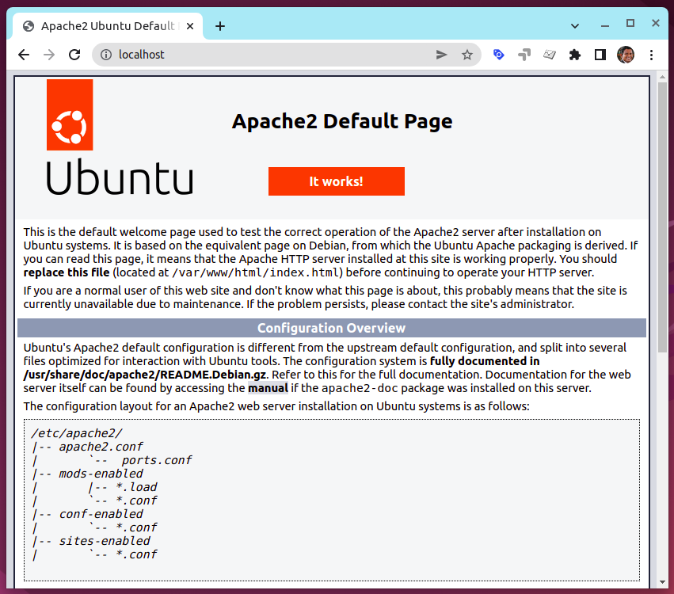
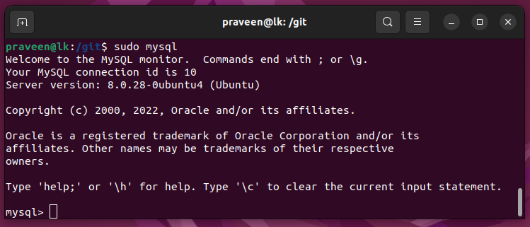
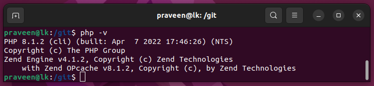
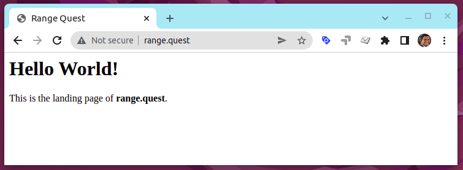

# LAMP Stack on Ubuntu 22.04

LAMP > **L**inux operating system, with the **A**pache web server. The site data is stored in a **M**ySQL database, and dynamic content is processed by **P**HP.

sudo apt update

sudo apt install apache2

sudo ufw app list


sudo ufw allow in "Apache"

sudo ufw status


# http://localhost/



# MySQL

sudo apt install mysql-server

sudo mysql_secure_installation

sudo mysql



# PHP

sudo apt install php libapache2-mod-php php-mysql



# Virtual Hosts

sudo mkdir /var/www/range.quest

sudo chown -R $USER:$USER /var/www/range.quest

sudo gedit /etc/apache2/sites-available/range.quest.conf

```
<VirtualHost *:80>
    ServerName range.quest
    ServerAlias www.range.quest 
    ServerAdmin webmaster@localhost
    DocumentRoot /var/www/range.quest
    ErrorLog ${APACHE_LOG_DIR}/error.log
    CustomLog ${APACHE_LOG_DIR}/access.log combined
</VirtualHost>
```

sudo a2ensite range.quest

sudo a2dissite 000-default

sudo apache2ctl configtest

sudo systemctl reload apache2

gedit /var/www/range.quest/index.html

```
<html>
  <head>
    <title>Range Quest</title>
  </head>
  <body>
    <h1>Hello World!</h1>

    <p>This is the landing page of <strong>range.quest</strong>.</p>
  </body>
</html>
```

