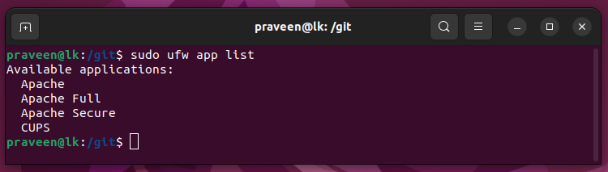
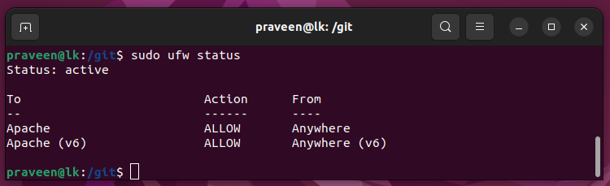

# LAMP Stack on Ubuntu 22.04

LAMP > **L**inux operating system, with the **A**pache web server. The site data is stored in a **M**ySQL database, and dynamic content is processed by **P**HP.

sudo apt update

sudo apt install apache2

sudo ufw app list

sudo ufw allow in "Apache"

sudo ufw status

